> This project is part of a development track I participated in. Throughout the course, I encountered learning challenges, and here I will attempt to share some of what I observed.

Home page
-
> Aprendizado:  conceitos de lógica de programação e evoluir para o desenvolvimento das teorias de HTML, CSS e JavaScript, dando suporte para aplicações Web

Modulo 1 >>>>>>>>>>>>>>>>>>>>>>>>>>>>>>>>>>>>>>>>>
-
- lógica de programação e de algoritmos
- desenvolvendo o pensamento crítico para a resolução de problemas em programação
- técnicas na construção de algoritmos
- praticar os conceitos de estrutura sequencial, estrutura de seleção e estrutura de repetição

Avaliação ao final do modulo
-
- 10 atividades objetivas e 1 projeto prático de programação.

Notas
-
- Nota mínima para aprovação das atividades objetivas: 6,0 pontos
- O projeto prático de programação será avaliado por fez/não fez.

=> Aula 1 - Introdução logica para Web
-
> Se sua meta é:
- criar aplicação web
- aplicativo pro seu smartphone ou,
- automatizar tarefas do dia a dia

A logica de programação será seu ponto de partida.

> Logica antes de codar!
- Entender o problema antes de codar.
- Raciocinio dedutivo, ou modo de raciocinar de forma coerente, causa e consequencia.
  - dedução, ou seja utliza-se da regra e sua premissa para chegar a uma conclusão.
  - Indução, determinar, aprender a regra a partir de diversos exemplos.
  - abdução, usa-se a conclusão e a regra pra defender que a premissa poderia explicar a conclusao.
- Logica é comunicação!

=> Materializar a logica...
> Algoritmo
> 
Procedimentos precisos, não ambiguos, padronizados, eficientes e coretos.

- No dia a dia usamos algoritmos a todo momento, podemos até não escrever mas estamos fazendo quando por exemplo tomamos decisões para alguma tarefa.
- Ele pode ser apresentado por:
  - fluxogramas
    
  - pseudocodigos
    
  - linguagem
    - javaScrip, html por exemplo.

=> Linguagem HTML
-
É uma linguagem de marcação, desenvolvido por meio de TAGS como:   
` `, que serve para pular linha
 
`<h1></h1>`, que serve para destacar um texto e, etc.
 
Html é uma linguagem estatica ou seja, seria impossivel fazer algo sofisticado com ele, havendo a necessidade de uma segunda linguagem.

* O navegador poliglota, ou seja pode entender tanto HTML, JavaScript entre outras.

=> Linguagem JavaScript
-
Linguagem de script, orientada a objeto, dinamica.

* essa imagem retrata a contribuição de cada linguagem para criação de uma aplicação.

=> Linguagem CSS
-
Linguagem de estilização.

Interpretação
-
Para o navegador entender uma instrução javaScript é preciso criar uma tag chamada `script` e colocar dentro dela o codigo javaScript.

    

Estrutura padrão
-
    <meta charset="UTF-8">
    Code here Html
    

Explicação da pagina
-

*body - onde fica o corpo do texto.

Comandos e Variaveis
-
Primeiro objeto: document 
`document.write("text")` 
* função chamada `write`, que é um metodo. 
Isso tambem pode ser feito pelo console. Veja: 
Todo navegador tem um **depurador** que pode ser acessado pelo atalho F12, é um ambiente do desenvolvedor onde o mesmo pode investigar e inspecionar seu codigo.

=> Tipos de variaveis
  Em javaScript todas as variaveis sao objetos, não sendo necessario declarar o `tipo` da mesma;
 Os numeros são todos reais de 64bits;
  A variavel tera seu tipo de dado alterado confrome seu valor for sendo atribuido;
   - Tipo de dado _dinamico_

    var x;       // x é indefinido
    x = 5;       // x é um numero
    x = "Jao"    // x é uma string
    x = true     // x é um valor logico
    x = null     // x é indefinido
  Nomes de variaveis
-
  - Devem começar com letra, depois letras, numeros e underlaine `_`;
  - Atribuição de valores, dados as variaveis se faz com sinal de iguadade `=`;
  - Comando de entrada usado no javaScript é o metodo `prompt()` para _strings_;
    - Para variaveis numericas: `+prompt()`;
 => Chegamos então a então **interação** entre o usuario e o codigo, a maquina;

Exemplo:

- Vamos fazer um programa onde voce se apresenta com nome, profissao e lugar onde mora.
  - use variaveis e comandos de entradas que foram explicados anteriormente;

        <meta charset="UTF-8">

        

   Operadores
=

->Aritméticos

|Sinal   |Explicação | Exemplo
|-          |-          |-
|+, -       | Operadores unários, ou seja, aplicado a um unico operando | +3, -x
|+, -, *, / | aritméticos tradicionais de adição, subtração, multiplicação e divisão | 5+2=7 5*2=10 5/2=2.5
| % | módulo, ou seja, resto da divisão | 8 MOD 3 = 2
| ^ | potênciação | 5^2=25

-> Op. de Caracteres

| +  | concatenação de strings  | "Rio" + "de Janeiro" = Rio de Janeiro
|-   |-                         |-

-> Relacionais

| = =  | igual  a  | 3 = 3 -> resulta em verdadeiro
|-     |-                          |- 
|  <   | menor que | 3 < 3 -> resulta em falso
|  >   | maior que | 3 > 3 -> resulta em falso
| <=   | menor ou igual a | 3 <= 3 -> resulta em verdadeiro
| >=   | maior ou igual a | 3 >= 3 -> resulta em verdadeiro
| !=   | diferente de     | 3 != 3 -> resulta em falso

-> Lógicos

| &&   | E lógico  | 3 = 3 -> X && y
|-     |-                          |- 
|  II  | OU lógico | X II y
|  !   | negação lógica | !x

 
 

Pratica
-

Exemplo2:  
Faça um programa que leia dois valores númericos, e calcule e exiba a sua média aritmética.
- - `ParseInt` função que analisa argumento 'String' e retorna  um valor númerico inteiro;
- - `ParseFloat`função que analisa argumento 'String' e retorna  um número de ponto flutuante, ou seja, retorna valores decimais;
- - usar o operador unário `+` antes do prompt também é uma opção;

 

Exemplo3: 
Faça um algoritmo que leia a base e a altura de um triângulo. Em seguida calcule a sua área e imprima os seguintes valores: `base`, `altura` e `área`.
- - conceito de área: multiplicação de base `*` altura `/` por 2;
 

Exemplo4: 
Construa um algoritmo para ler dois números. Em seguida, calcule a soma`+`, a subtração`-`, a multiplicação`*` e a divisão`/` desses números, armazenando os resultados em outras variáveis. Imprimir os dados iniciais e os resultados.
 

Exemplo5: 
Construa um algoritmo para dividir dois números e imprimir o resultado.

 

Desafio
-
Escreva um algoritmo que leia tres lados quaisquer. Identifique `se` esses lados podem formar um triangulo. `Caso` os lados formem um triangulo, identifique se o triangulo é equilátero, escaleno ou isósceles.
 
Regra:
  Lados a, b e c;
- - É triângulo `somente se` a condição for satisfeita: `(a+b)>c e (a+c)>b e (b+c)>a`:
  - A condição if (a + b > c && a + c > b && b + c > a) verifica se os três lados podem formar um triângulo. Essa verificação é baseada na propriedade matemática de que em um triângulo válido, cada lado deve ser menor do que a soma dos outros dois lados.
- - Equilátero: `se` todos os lados iguais;
- - Escaleno: todos os lados diferentes;
  - exemplo:   Verifiquemos as condições de desigualdade: 
𝑎+𝑏=3+6=9 
a+b=3+6=9 
𝑎+𝑐=3+8=11 
a+c=3+8=11 
𝑏+𝑐=6+8=14 
b+c=6+8=14 
Todas as condições são satisfeitas: 
9>8 
9>8 
11>6 
11>6 
14>3 
14>3 
Portanto, 
3,6 
3,6 e 8 
8 podem formar um triângulo escaleno.
 
Estes são exemplos de triângulos escalenos, onde todos os lados têm medidas diferentes e satisfazem as condições para formação de um triângulo.
- - Isósceles: dois lados são iguais;

AULA 2
-

 

Estrutura Condicional simples e composta
-
"Se tiver R$ 90,00 sobrando então ierei comprar uma calça." 
-> Ela é uma expressão lógica, pois a pergunta "tenho R$ 90,00 sobrando?" pode (tem que) ser respondida com "SIM" ou "NAO" 
- - esse é um exemplo de estrutura condicional simples. 
Em algoritmo toda condição tem que ser uma expressão lógica. 
-> VERDADEIRO ou FALSO 
Exemplo de sintaxe: 

          if (condicao) {
            < acao acontecera se condicao for verdadeira >
          }
-
          if (tenho R$ 90,00) {
            < comprar calca >
          }
 

Exemplo 1) Crie um algoritmo que leia o nome de uma pessoa, o ano em que essa pessoa nasceu e o ano atual. Calcule  a idade dessa pessoa e imprima uma mensagem caso ela já possua a maioridade(21 anos). 
 

-> Sintaxe de uma estrutura condicional composta
 

      if (condicao) {
        <(acoes se condicao for TRUE)>
      } else {
        <(acoes se condicao for FALSE)>
      }
 

Exemplo 3) Suponha que o cenário financeiro estaja complexo e voce resolve considerar a viagem também pelo Brasil. Sendo assim mantém a condição da viagem para Europa, mas caso o saldo juntado seja inferior a R$ 10.000,00 a viagem será feita dentro do Brasil. Faça um programa que leia o saldo e decida a viagem.
 

      if (saldo >= 1000) {
        <(viagem para Europa)>
      } else {
        <(viagem dentro do Brazil)>
      }
 

Exemplo 4) Faça um algoritmo para calcular a área de um círculo. O valor do raio deve ser lido pelo program e deve ser positivo.
 

- - Para calcular a area de um circulo, você utiliza a formula: 
Area = π × raio² 
- - Onde: 
  - π (pi) é uma constante aproximadamente igual a 3,14159 (ou pode usar o valor mais preciso necessário para suas aplicações); 
  - raio é a distância do centro do círculo até a sua borda. 
 
- - Passos para calcular a área de um círculo: 
  - Meça o raio do círculo:
    - Esta é a distância do centro até a borda do círculo. 
  - Substitua o valor do raio na fórmula:
    - Elevar o raio ao quadrado significa multiplicar o raio por ele mesmo. 
  - Multiplique pelo valor de π:
    - Use o valor de π adequado para suas necessidades (geralmente 3,14159 é suficiente para muitas aplicações). 
- - Exemplo: 
Suponha que o raio do círculo seja r = 5 unidades. 
Area = π × 5² 
Area = π × 25 
Area ≈ 3.14159 × 25 
Area ≈ 78.54 
Portanto, a área do círculo com raio `5` unidades é aproximadamente 78.5478.54 unidades quadradas.
 

Exemplo 5) Suponha que voce faz uma analise mais realista da viagem e conclui que um saldo menor que R$ 3.000  é melhor não viajar. Fique em casa!! Sendo assim, mantém a condição da viagem para Europa, e caso o saldo juntado seja inferior a R$ 10.000 e igual ou superior a R$ 3.000, a viagem acontecerá no Brasil. Tendo todas essas novas informações, faça um programa que leia o saldo e decida a viagem.

 

Estrutura Condicional switch-case
-

Comando de alternativa de multipla escolha;
- - para cada caso um tipo de resposta, um bloco de resposta a ser atendida;
  - Sintaxe geral:
  - `switch` é uma  espressao de selecao que sera avalida;
  - para cada caso digitado;
  - lista de comando e um `breack`, para parar, stop no codigo;
 

Exemplo 6) Um determinado clube de futebol pretende classificar seus atletas em categorias e para isto ele contratou um desenvolvedor para criar um programa que execute esta tarefa. Para isso o clube criou uma tabela que contem a faixa etaria do atleta e sua categoria.

------

Atividades
-
 

1) Escreva um programa que leia um numero inteiro. Se o numero lido for positivo, escreva uma mensagem indicando se ele é par ou ímpar. Se o numero for negativo, escreva a seguinte mensagem "Este numero não é positivo".
- _Um número inteiro positivo é um `número que é maior que zero e não possui partes decimais`. Exemplos incluem 1, 2, 3, 4, 5, e assim por diante._
  - exemplo de comando:

        num > 0

-_Em termos matemáticos, `0` não é estritamente positivo nem negativo, mas `-O` pode ser considerado como uma representação numérica específica   que é menor que `0` em alguns contextos._
_Para verificar se um número é negativo, incluindo o caso de `-0`, em JavaScript, você pode usar uma simples comparação numérica._

      numero < 0 || (numero === 0 && 1/numero === -Infinity

_Em JavaScript, você pode verificar se um número é `-0` comparando `1/numero` com `-Infinity`. Isso ocorre porque `1/-0` resulta em `-Infinity`, enquanto `1/0` resulta em `Infinity`. Essa verificação é útil para distinguir `-0` de `0`._

- _Um número inteiro positivo par é um `número inteiro que é maior que zero, não possui partes decimais e é divisível por 2`. Exemplos de números inteiros positivos pares incluem 2, 4, 6, 8, 10, e assim por diante._
  - exemplo de comando para verificar se é par:

        num % 2 === 0

  - exemplo de comando para verificar se é ímpar:

        num % 2 !== 0

  

2) Faça um algoritmo que receba o valor do salario de uma pessoa e o valor de um financiamento pretendido. Caso o financiamento seja menor ou igual a 5 vezes o salario da pessoa, o algoritmo devera escrever "Financiamento Concedido"; senão, ele devera escrver "Financiamento Negado". Independente de conceder ou nao o financiamento, o algoritmo escrevera depois a frase "Obrigado por nos consultar.". 

 

3) Escreva um algoritmo que calcule a media de um aluno numa dada disciplina e imprima o resultado. `Regra:` Durante o semestre o aluno faz 3 avaliações com notas de 0 a 10. É considerado aprovado, o aluno que consegue nota igual ou superior a 7. Se este ficar com nota menor que 7 e maior ou igual a 5, sera considerado de recuperaçao. No entanto, se a nota for abaixo de 5, o aluno sera considerado reprovado e devera repetir o semestre.

 

4) Escreva o algoritmo "Programa Solitario". O doador deve clicar nas opçoes (mostradas abaixo) para efetuar a sua doação. Imprima o resultado na tela com o valor da doação e uma mensagem de agradecimento. Utilize a estrutura `Switch...Case`.   [1] para doar R$ 10   [2] para doar R$ 25   [3] para doar R$ 50   [4] para doar outros valores   [5] para cancelar.

 

5) Escreva o algoritmo que calcule o IMC de uma pessoa e imprima a situação em que ela se encontra. `Regra:` IMC = Massa / Altura²  

* (maior ou igua a 40 ....)

O Índice de Massa Corporal (IMC) é uma medida que relaciona o peso e a altura de uma pessoa. Ele é amplamente utilizado para categorizar o peso de acordo com as seguintes faixas:

1. **Abaixo do peso:** IMC abaixo de 18,5
2. **Peso normal:** IMC entre 18,5 e 24,9
3. **Sobrepeso:** IMC entre 25 e 29,9
4. **Obesidade:** IMC 30 ou superior

Para calcular o IMC, você pode seguir estas etapas:

1. **Obtenha seu peso em quilogramas (kg).**
2. **Obtenha sua altura em metros (m).**
3. **Calcule o IMC utilizando a fórmula:**

Por exemplo, se uma pessoa pesa 70 kg e tem 1,75 m de altura:

Neste caso, o IMC calculado é aproximadamente 22.86, o que está dentro da faixa de peso normal.

É importante lembrar que o IMC é uma medida simples e rápida, mas não leva em consideração a composição corporal (como músculos versus gordura), nem a distribuição de gordura corporal. Por isso, é sempre bom considerar outras medidas de saúde e consultar um profissional da saúde para uma avaliação mais completa.
 

## Challenge: 
Faça um programa que leia quatro valores I, n1, n2, e n3 são `quaisquer valores reais`. O programa deve escrever os valores lidos e:   

-------
Valores reais referem-se a qualquer número que pode ser encontrado em uma reta numérica, incluindo números inteiros, decimais e frações. Em outras palavras, são todos os números que não são complexos ou imaginários. Exemplos de valores reais incluem:

- Números inteiros como -3, 0, 7
- Números decimais como -1.5, 2.718, 10.333
- Frações como 3/4, -2/5, 1/2

Esses valores podem ser positivos, negativos ou zero, e são representados em uma linha contínua, permitindo que sejam comparados e operados matematicamente de acordo com as regras usuais da aritmética.

 

------
- se I = 1, escrever os tres valores n1, n2 e n3 em ordem crescente;
- se I = 2, escrever os tres valores n1, n2 e n3 em ordem decrescente;
- se I = 3, escrever os tres valores n1, n2 e n3 de forma que o maior valor fique entre os outros dois;

 

- se I nao for um dos tres valores acima, imprima uma mensagem indicando este comportamento.

 

Dicas
-

- Funcoes internas do Java Script

escape - obtem o codigo ASCII de um caracter que não seja alfa-numerico. Ex: `document.write(escape("@"))`.

eval - avalia uma expressao numerica retornando um resultado tambem numerico. Ex: `document.write(eval(10*9*8*7*6*5*4*3*2*))`.

confirm - Mostra uma caixa de dialogo, seguida de um sinal sonoro e os botões `OK`,`CANCEL`. Retorna um valor verdadeiro se o usuario escolher `OK`. Ex: retorno = `confirm("Deseja prosseguir?")`.

parseFloat - converte uma string que representa um number para um number com ponto flutuante. Caso a string não possa ser avaliada, a função retorna zero. Ex: `document.write(parseFloat("parseFloat("-32.465e12"))`.

parseInt - converte uma string que representa um numero em uma base predefinida para base 10. Caso string possua um caracter que não possa ser convertido a operação para, retornando o valor antes do erro. Ex: `parseInt("string", base)`.

-----
- - A estrutura switch-case (escolha-caso) pode ser aplicada em diversos problemas de lógica e algoritmo. Em relação a essa estrutura pode-se afirmar:

| A estrutura condicional com múltiplas escolhas é conhecida como switch-case e oferece várias alternativas como resposta de acordo com as opções dadas. 
|-

- - Exemplo de estrutura condicional composta

          if (condição){
        <ações a serem realizadas se a condição for verdadeira>
        }else{
        < ações a serem realizadas se a condição for falsa >   
        }

------

AULA 3
-

 

| Repetition structure
|-

- Imagine desenvolver um algoritmo para ler a media das notas de 3 provas de um aluno.
  - E se esse processo ter que ser realizado 40 vezes já que numa dada sala de aula existe essa quantidade de aluno.

Ate a ultima aula os problemas foram resolvidos em uma sequencia de intruções executadas uma unica vez.

Seguia uma sequencia linear de operações.

| Exemplo 1
|-

- -  Este codigo não esta dinamico, e seria isustentavel caso o problema exigisse a leitura de notas, media de uma sala de aula com 40 alunos por exemplo.
  -  para resolver isso existe na logica de programação um conjunto de`Estrutura de Repetição` para tornar o algoritmo mais limpo e pratico - `While / do...While / for`.

 
 

| Estrutura WHILE - (Enquanto)
|-

- - sintaxe

        while (expressao logica)
        { -> condicao (enquanto esta condicao for true a ...) 
        <lista de comandos>  -> (...sera executada.)
        }

| Exemplo 2
|-
Suponha um algoritmo que conte de 0 ate 10. Escreva uma frase quando terminar de contar.   

 -> saida do algoritmo no navegador

 
 

| Exemplo 3 
|-
Suponha um algoritmo que conte de 10 até 0. Escreva uma frase quando terminar de contar.

 
 

| Exemplo 4 
|-
Voce pode criar um algoritmo `mais interativo`. Portanto, escreva um algoritmo que o usuario `digite a quantidade de numeros` que ele deseja somar. Faça com que o programa leia esses numeros e no final `apresente o resultado da soma`.
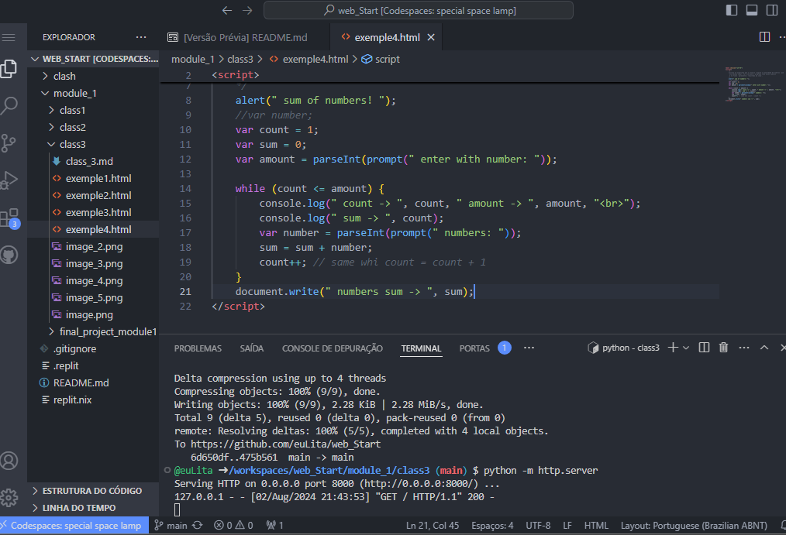
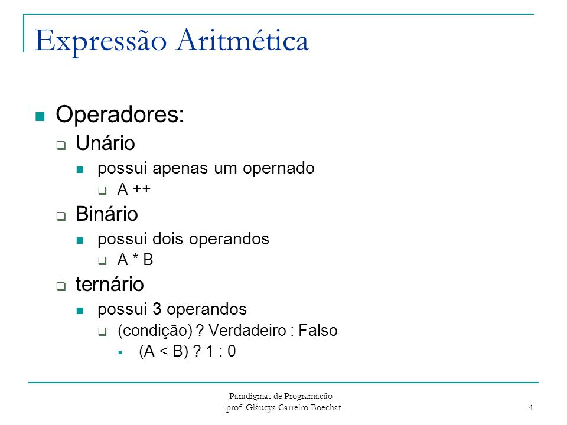

 
 

| Exemplo 5 
|-
O algoritmo `média dos alunos` pode ser reescrito de uma forma mais `prática`.
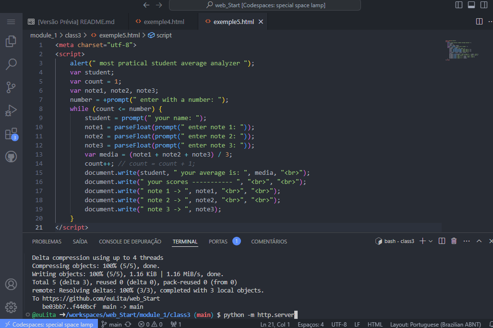
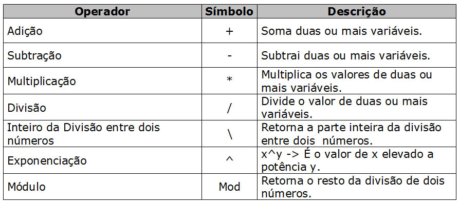

 
 

| DO WHILE 
|-

- - Todas os comandos são executados, e uma expressao logica é avaliada no final.
  - a estrutura `do while` significa que ela se repete ate que a avaliaçao da condiçao resulte em `FALSE` ou seja, uma lista de comandos é realizada pelo menos uma vez, e logo apos execução dessa lista de comandos a expressao logica é avaliada, se a condição for `TRUE` o laço continua repetindo e executando a lista de comandos proposto, caso contrario, essa extrutura é paralisada e o fluxo do codigo do programa continua.

- - sintaxe

        do 
        {
        <lista de comandos>
        } while (expressao logica)

 
 

| Exemplo 6
|-
Faça um algoritmo que escreva os numeros de `0` a `9`.

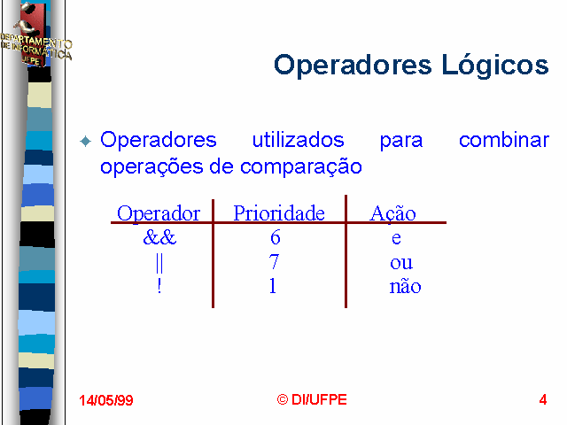

 
 

| Exemplo 7
|-
Escreva um algoritmo que leia um dado numero e imprima na tela a sua tabuada.
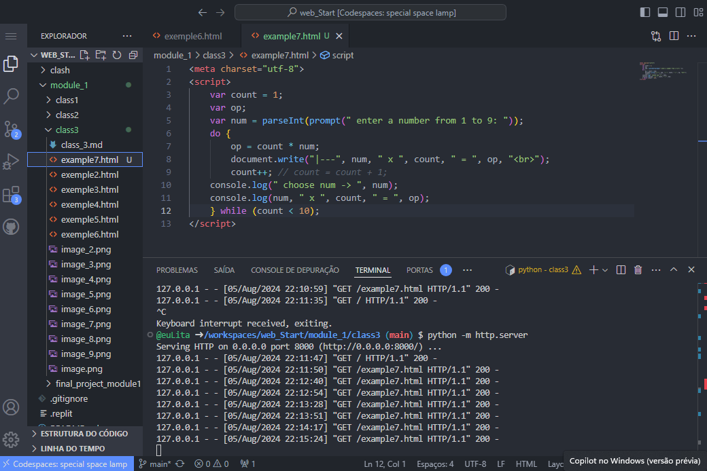
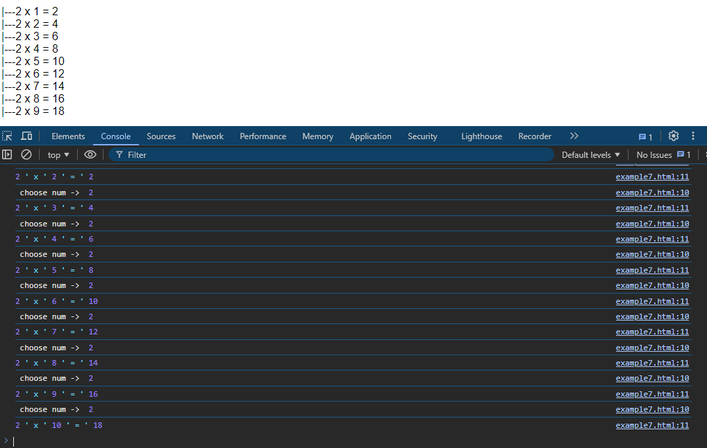

 
 

| Exemplo 8
|-
Escreva um algoritmo que _**`leia uma quantidade de numeros`**_ e imprima o resultado informando a quantidade de _**`numeros digitados que sao negativos`**_. Imagina que o usuario escolhe quantos numeros ele deseja digitar.
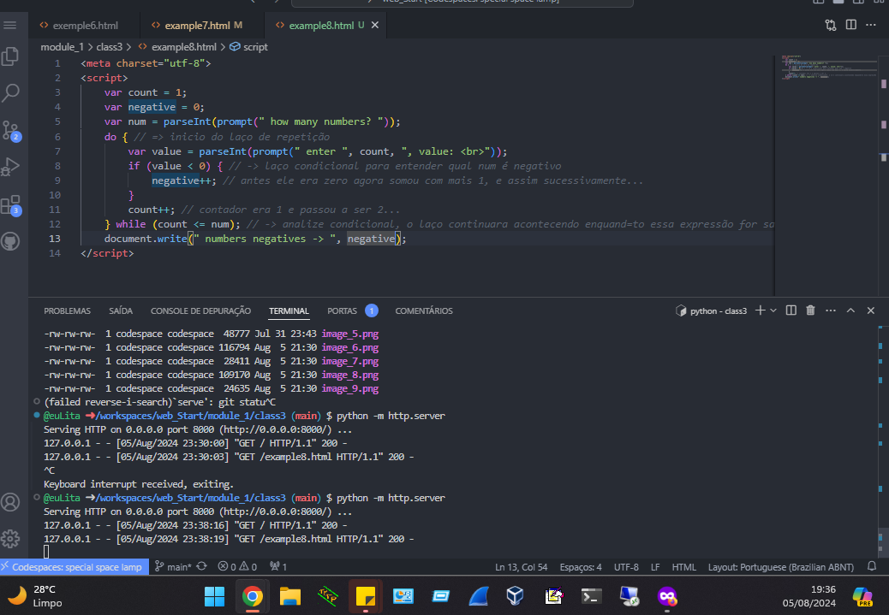

 
 

| LOOP INFINITO
|-

- - `A diferença básica é a posição de onde é testada a expressão.`
  - Uma observação importante, a variavel de controle deve ser iniciada fora, caso contrario o seu codigo ficara em um loop infinito.

 
 

| FOR
|-

- - sintaxe

        for (contador inicializada; condição de parada;             incremento contador)
        {
         <comandos a serem executados>
        }

 
 

| Exemplo 11
|-
Suponha um algoritmo que leia e escreva os numeros impares de 1 a 100. `É possivel usar a estrutura **_for_**`.
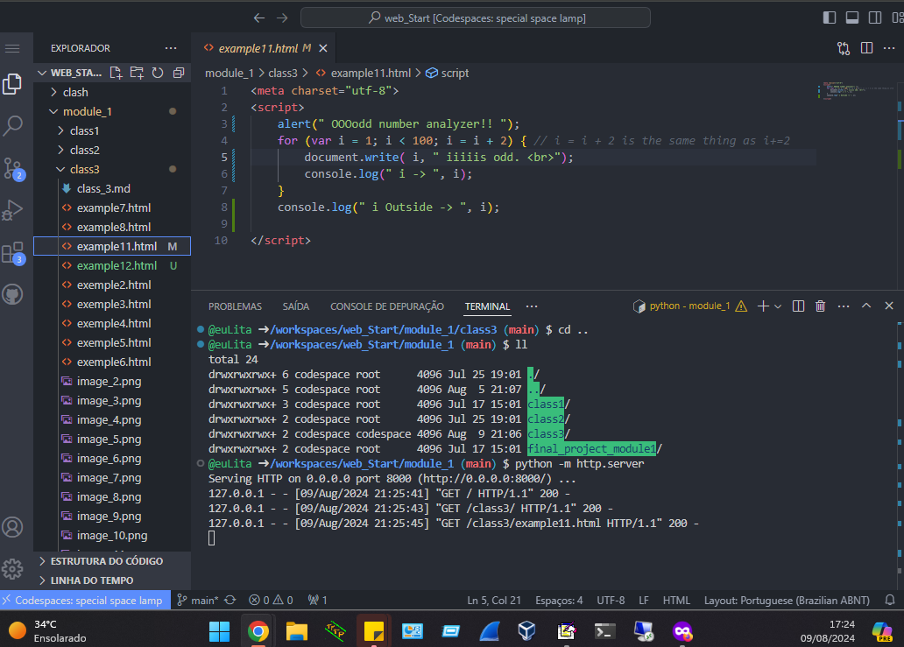
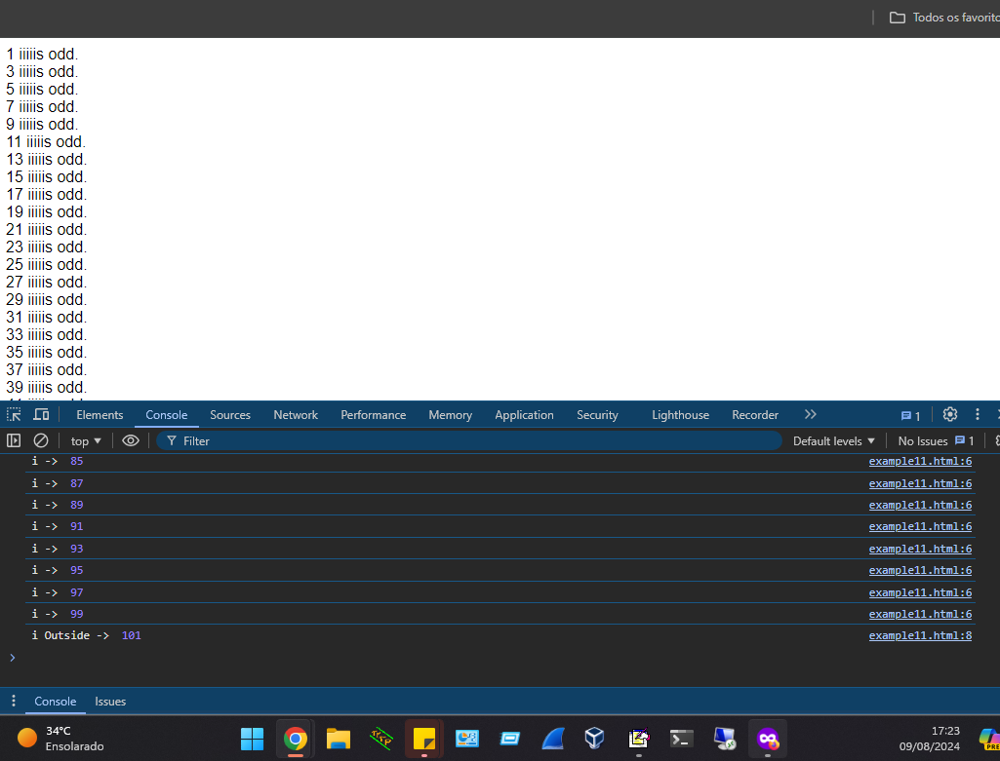

 
 

| Exemplo 12
|- 
Escreva um algoritmo que leia 5 números e os classifique como positivo ou negativo. Imprima o resultado.
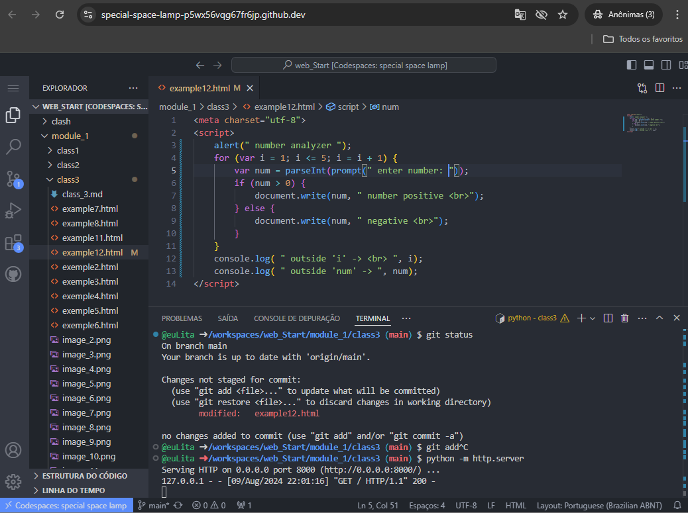
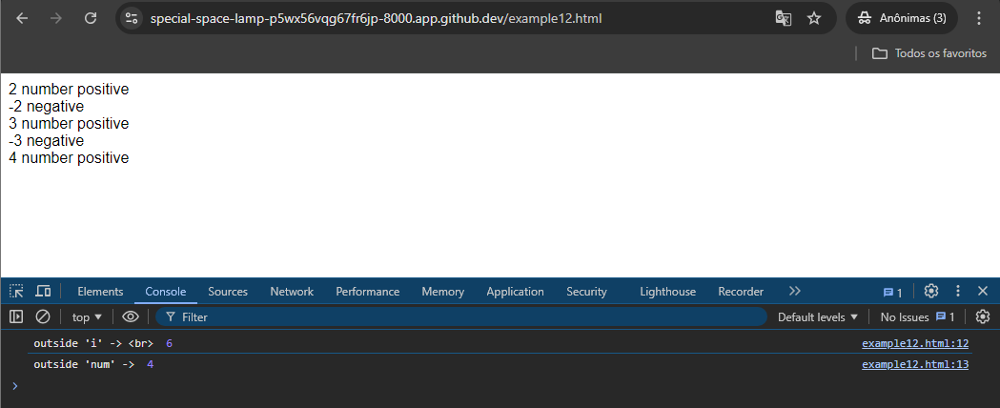

 
 

| `ATIVIDADES E DICA`
|-

 
 

| Atividade 1
|- 
Faça um algoritmo que leia um dado número e imprima na tela se este é um número primo ou não.

- - Um número inteiro é um número sem parte fracionária ou decimal. Os inteiros incluem:
  - Números naturais positivos (1, 2, 3, 4, ...);
  - O zero (0);
  - Números naturais negativos (-1, -2, -3, -4, ...);
  - Os inteiros podem ser representados pela letra 𝑍;
    - Z em matemática e englobam todos os números que não possuem frações ou decimais. Por exemplo:
      - Positivos: 1, 20, 345;
      - Negativos: -1, -20, -345;
      - Zero: 0
 
 

| Atividade 2
|- 
Escreva um programa que repita a leitura de uma senha até que ela seja válida. Para cada leitura de senha incorreta informada, escrever a mensagem "Senha invalida" e "Tente novamente". Quando a senha for informada corretamente deve ser impressa a mensagem "Acesso Permitido" e o algoritmo encerrado. Considere que a senha correta é o valor 2023. 

 
 

| Atividade 3
|- 
Escreva um programa para ler as coordenadas (X,Y) de uma quantidade indeterminada de pontos no sistema cartesiano. Para cada ponto escrever o quadrante a que ele pertence. O algoritmo sera encerrado quando pelo menos uma das duas coordenadas for NULA. Nesta situaçao escreva uma mensagem "Algoritmo Interrompido!!".

 
 

| Atividade 4
|- 
Uma grande empresa deseja determinar qual de seus produtos tem a preferencia de seus clientes. Escreva um algoritmo para ler o tipo de produto comprado codificando da seguinte forma:
1 ProdutoA
2 ProdutoB
3 ProdutoC
4 Fim
Caso o usuario informe um codigo invalido (fora da caixa de 1 a 4) deve ser solicitado um novo codigo (ate que seja valido). O programa sera encerrado quando o codigo informado for o numero 4. Deve ser escrito a mensagem: "MUITO OBRIGADO" e a quantidade de clientes que compraram cada tipo de produto.

 
 

| Atividade 5
|- 
 Um funcionario de uma empresa recebe, anualmente, aumento salarial. Sabe-se que: 
 a) esse funcionario foi contratado em 2018, com salario inicial de R$ 2.000,00;
 b) em 2019, ele recebeu aumento de 1,5%, sobre o seu salario inicial;
 c) a partir de 2020 (inclusive), os aumentos salariais sempre corresponderam ao dobro do percentual do ano anterior. Faça um programa que determine o salario desse funcionario no ano de 2023. Apresente todos os valores.

