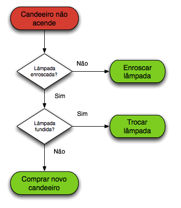
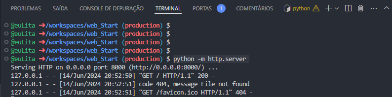
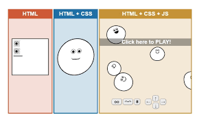
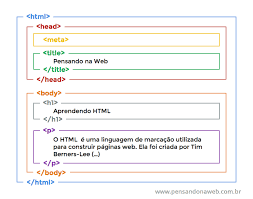

> This project is part of a development track I participated in. Throughout the course, I encountered learning challenges, and here I will attempt to share some of what I observed.

Home page
-
> Aprendizado:  conceitos de lógica de programação e evoluir para o desenvolvimento das teorias de HTML, CSS e JavaScript, dando suporte para aplicações Web

Modulo 1
-
- lógica de programação e de algoritmos
- desenvolvendo o pensamento crítico para a resolução de problemas em programação
- técnicas na construção de algoritmos
- praticar os conceitos de estrutura sequencial, estrutura de seleção e estrutura de repetição

Avaliação ao final do modulo
-
- 10 atividades objetivas e 1 projeto prático de programação.

Notas
-
- Nota mínima para aprovação das atividades objetivas: 6,0 pontos
- O projeto prático de programação será avaliado por fez/não fez.

=> Aula 1 - Introdução logica para Web
-
> Se sua meta é:
- criar aplicação web
- aplicativo pro seu smartphone ou,
- automatizar tarefas do dia a dia

A logica de programação será seu ponto de partida.

> Logica antes de codar!
- Entender o problema antes de codar.
- Raciocinio dedutivo, ou modo de raciocinar de forma coerente, causa e consequencia.
  - dedução, ou seja utliza-se da regra e sua premissa para chegar a uma conclusão.
  - Indução, determinar, aprender a regra a partir de diversos exemplos.
  - abdução, usa-se a conclusão e a regra pra defender que a premissa poderia explicar a conclusao.
- Logica é comunicação!

=> Materializar a logica...
> Algoritmo
> 
Procedimentos precisos, não ambiguos, padronizados, eficientes e coretos.

- No dia a dia usamos algoritmos a todo momento, podemos até não escrever mas estamos fazendo quando por exemplo tomamos decisões para alguma tarefa.
- Ele pode ser apresentado por:
  - fluxogramas
    
  - pseudocodigos
    
  - linguagem
    - javaScrip, html por exemplo.

=> Linguagem HTML
-
É uma linguagem de marcação, desenvolvido por meio de TAGS como:   
` `, que serve para pular linha
 
`<h1></h1>`, que serve para destacar um texto e, etc.
 
Html é uma linguagem estatica ou seja, seria impossivel fazer algo sofisticado com ele, havendo a necessidade de uma segunda linguagem.

* O navegador poliglota, ou seja pode entender tanto HTML, JavaScript entre outras.

=> Linguagem JavaScript
-
Linguagem de script, orientada a objeto, dinamica.

* essa imagem retrata a contribuição de cada linguagem para criação de uma aplicação.

=> Linguagem CSS
-
Linguagem de estilização.

Interpretação
-
Para o navegador entender uma instrução javaScript é preciso criar uma tag chamada `script` e colocar dentro dela o codigo javaScript.

    

Estrutura padrão
-
    <meta charset="UTF-8">
    Code here Html
    

Explicação da pagina
-

*body - onde fica o corpo do texto.

Comandos e Variaveis
-
Primeiro objeto: document 
`document.write("text")` 
* função chamada `write`, que é um metodo. 
Isso tambem pode ser feito pelo console. Veja: 
Todo navegador tem um **depurador** que pode ser acessado pelo atalho F12, é um ambiente do desenvolvedor onde o mesmo pode investigar e inspecionar seu codigo.

=> Tipos de variaveis
  Em javaScript todas as variaveis sao objetos, não sendo necessario declarar o `tipo` da mesma;
 Os numeros são todos reais de 64bits;
  A variavel tera seu tipo de dado alterado confrome seu valor for sendo atribuido;
   - Tipo de dado _dinamico_

    var x;       // x é indefinido
    x = 5;       // x é um numero
    x = "Jao"    // x é uma string
    x = true     // x é um valor logico
    x = null     // x é indefinido
  Nomes de variaveis
-
  - Devem começar com letra, depois letras, numeros e underlaine `_`;
  - Atribuição de valores, dados as variaveis se faz com sinal de iguadade `=`;
  - Comando de entrada usado no javaScript é o metodo `prompt()` para _strings_;
    - Para variaveis numericas: `+prompt()`;
 => Chegamos então a então **interação** entre o usuario e o codigo, a maquina;

Exemplo:

- Vamos fazer um programa onde voce se apresenta com nome, profissao e lugar onde mora.
  - use variaveis e comandos de entradas que foram explicados anteriormente;

        <meta charset="UTF-8">

        

   Operadores
=

->Aritméticos

|Sinal   |Explicação | Exemplo
|-          |-          |-
|+, -       | Operadores unários, ou seja, aplicado a um unico operando | +3, -x
|+, -, *, / | aritméticos tradicionais de adição, subtração, multiplicação e divisão | 5+2=7 5*2=10 5/2=2.5
| % | módulo, ou seja, resto da divisão | 8 MOD 3 = 2
| ^ | potênciação | 5^2=25

-> Op. de Caracteres

| +  | concatenação de strings  | "Rio" + "de Janeiro" = Rio de Janeiro
|-   |-                         |-

-> Relacionais

| = =  | igual  a  | 3 = 3 -> resulta em verdadeiro
|-     |-                          |- 
|  <   | menor que | 3 < 3 -> resulta em falso
|  >   | maior que | 3 > 3 -> resulta em falso
| <=   | menor ou igual a | 3 <= 3 -> resulta em verdadeiro
| >=   | maior ou igual a | 3 >= 3 -> resulta em verdadeiro
| !=   | diferente de     | 3 != 3 -> resulta em falso

-> Lógicos

| &&   | E lógico  | 3 = 3 -> X && y
|-     |-                          |- 
|  II  | OU lógico | X II y
|  !   | negação lógica | !x

 
 

Pratica
-

Exemplo2:  
Faça um programa que leia dois valores númericos, e calcule e exiba a sua média aritmética.
- - `ParseInt` função que analisa argumento 'String' e retorna  um valor númerico inteiro;
- - `ParseFloat`função que analisa argumento 'String' e retorna  um número de ponto flutuante, ou seja, retorna valores decimais;
- - usar o operador unário `+` antes do prompt também é uma opção;

 

Exemplo3: 
Faça um algoritmo que leia a base e a altura de um triângulo. Em seguida calcule a sua área e imprima os seguintes valores: `base`, `altura` e `área`.
- - conceito de área: multiplicação de base `*` altura `/` por 2;
 

Exemplo4: 
Construa um algoritmo para ler dois números. Em seguida, calcule a soma`+`, a subtração`-`, a multiplicação`*` e a divisão`/` desses números, armazenando os resultados em outras variáveis. Imprimir os dados iniciais e os resultados.
 

Exemplo5: 
Construa um algoritmo para dividir dois números e imprimir o resultado.

 

Desafio
-
Escreva um algoritmo que leia tres lados quaisquer. Identifique `se` esses lados podem formar um triangulo. `Caso` os lados formem um triangulo, identifique se o triangulo é equilátero, escaleno ou isósceles.
 
Regra:
  Lados a, b e c;
- - É triângulo `somente se` a condição for satisfeita: `(a+b)>c e (a+c)>b e (b+c)>a`:
  - A condição if (a + b > c && a + c > b && b + c > a) verifica se os três lados podem formar um triângulo. Essa verificação é baseada na propriedade matemática de que em um triângulo válido, cada lado deve ser menor do que a soma dos outros dois lados.
- - Equilátero: `se` todos os lados iguais;
- - Escaleno: todos os lados diferentes;
  - exemplo:   Verifiquemos as condições de desigualdade: 
𝑎+𝑏=3+6=9 
a+b=3+6=9 
𝑎+𝑐=3+8=11 
a+c=3+8=11 
𝑏+𝑐=6+8=14 
b+c=6+8=14 
Todas as condições são satisfeitas: 
9>8 
9>8 
11>6 
11>6 
14>3 
14>3 
Portanto, 
3,6 
3,6 e 8 
8 podem formar um triângulo escaleno.
 
Estes são exemplos de triângulos escalenos, onde todos os lados têm medidas diferentes e satisfazem as condições para formação de um triângulo.
- - Isósceles: dois lados são iguais;

