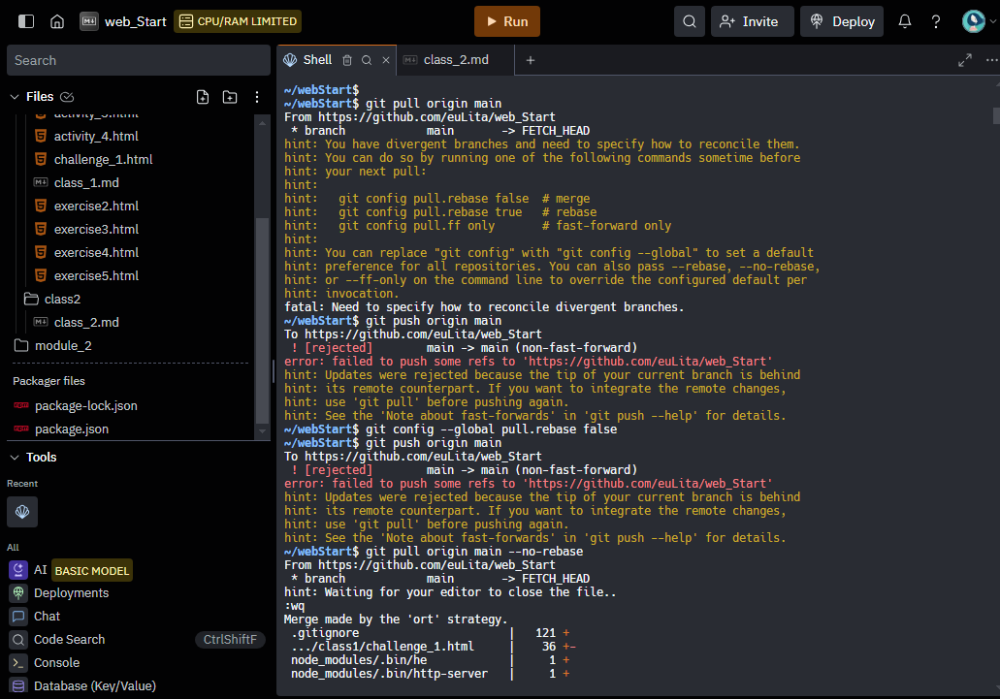
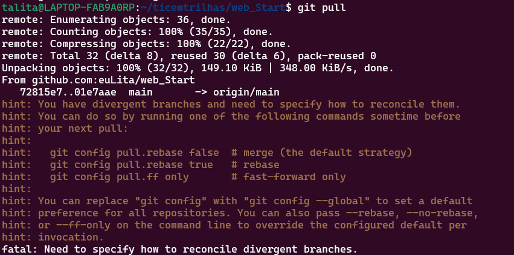
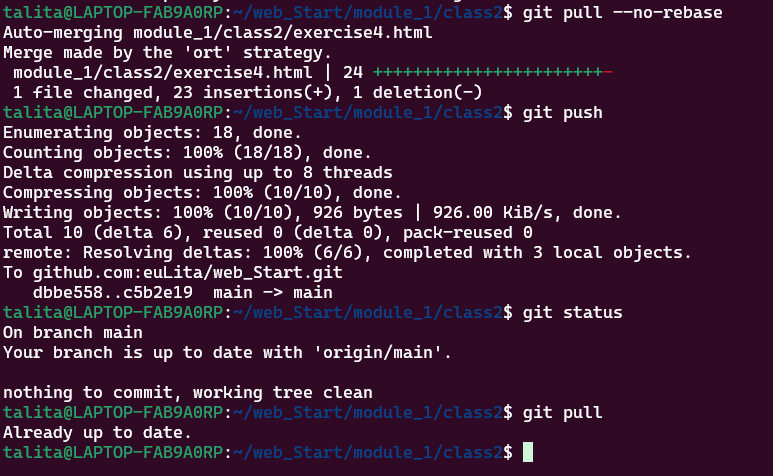
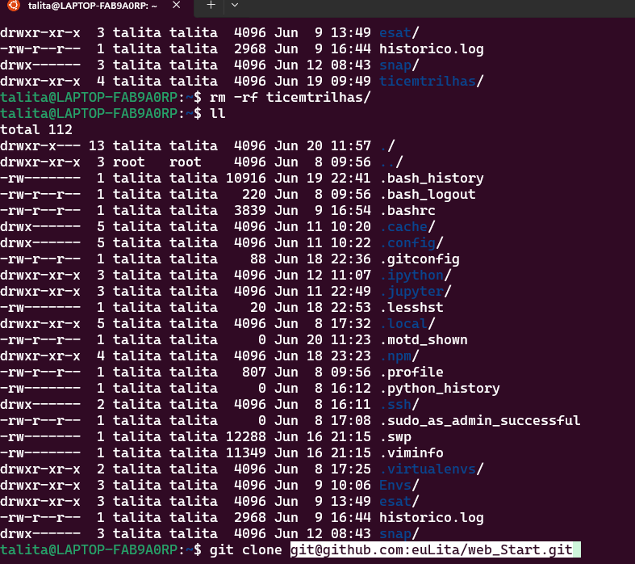
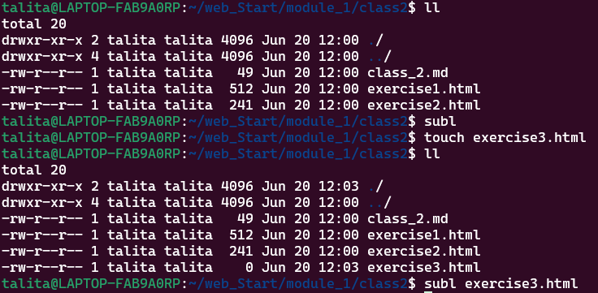
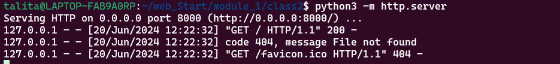
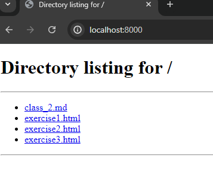
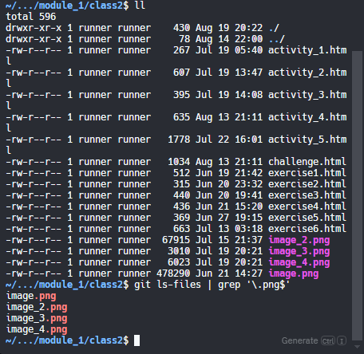

 

- - no replit.com

 

 

- - sincronizando as mudanças com o `merge` e o `pull` localmente

 

 

- - Apos o comando anterior(`git pull --no-rebase`), mesclagem padrão para resolver o problema no momento, o `vim` é aberto para adicionarmos como boa pratica, para cooperação na comunidade comentarios a respeito do problema e ou para explicar a razão de fazer o `merge`.
  - use o `Esc` para começar a inserir comentarios e o `Ctrl + O(letra o, de oculos)` para salvar, e `Ctrl + X` para sair.
  - depois é só continuar de onde parou, com o `git push`

 

 

- - Apagar o projeto localmente
   - `rm -rf`

 

 

  - `git clone <coloque seu endereço SSH do git>`

 

=> Alguns comandos práticos
=
  - criar new file: `touch <seu novo arquivo`;
  - abrir file no seu editor de texto, no caso o meu é o Sublime Text: `Subl <name file>`;

 

 

- - run no file `.html`:

 

`python3 -m http.server`
*no meu ambiente funcionou com este comando.
 

`http://localhost:8000` or `localhost:8080`

 

- - `killall sublime_text` - esse comando encerra, fecha todos os trabalhos sendo executados no Sublime Text.
  - se certifique de salvar seu projeto, arquivo no editor antes de executar este comando.

 

 

- - Adicionado o arquivo `node_modules` no `.gitignore` depois de já ter subido anteriormente, versionado.
  - depois de ter adicionado no `.gitignore` insira os seguintes comandos no terminal:

          git rm -r --cached node_modules

  

        git commit -m "Remove node_modules from version control"

 

        git push

## => Listar os arquivos com a extensão desejada:

      git ls-files | grep '\.log$'

- - `git ls-files`: Lista todos os arquivos rastreados pelo Git.
  - `grep '\.ext$`: Filtra os arquivos com a extensão `.ext`.

## => Remover os arquivos com a extensão desejada:

      git ls-files | grep '\.log$' | xargs git rm

- - `xargs git rm`: Passa a lista de arquivos filtrados para o comando `git rm`, que remove esses arquivos do repositório.

## => Listar e Mover os Arquivos:

      git ls-files | grep '\.log$' | xargs -I{} git mv {} archive/

- - `xargs -I{} git mv {} archive/`: Usa xargs para passar cada arquivo para o comando `git mv`, movendo cada arquivo para o diretório archive.

> outra maneira

      mv *.txt destino/
