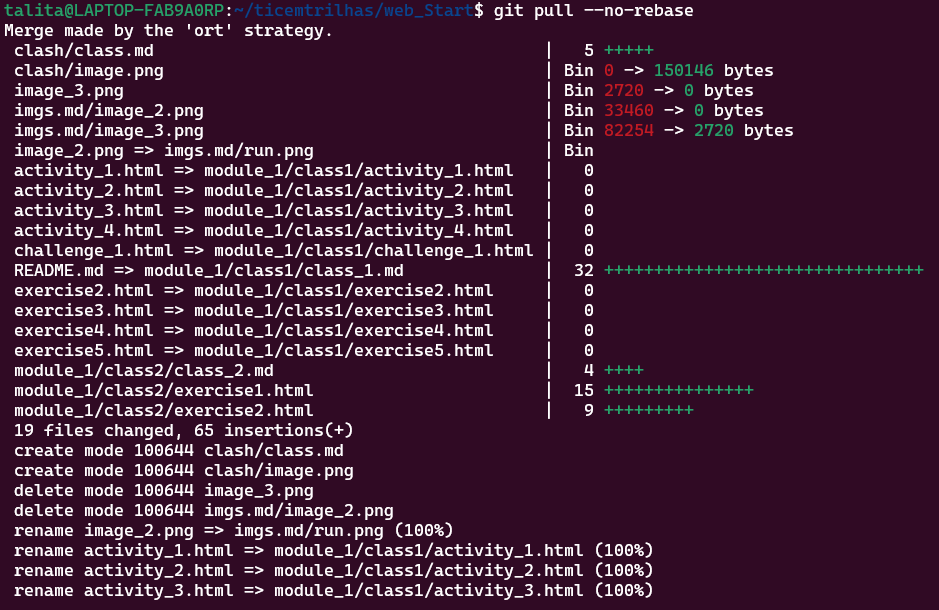

 

> make merge

 

> erro 1.1

 

 

- - Apos o comando anterior(`git pull --no-rebase`), mesclagem padrão para resolver o problema no momento, o `vim` é aberto para adicionarmos como boa pratica, para cooperação na comunidade comentarios a respeito do problema e ou para explicar a razão de fazer o `merge`.
  - use o `Esc` para começar a inserir comentarios e o `Ctrl + O(letra o, de oculos)` para salvar, e `Ctrl + X` para sair.

 

1. Apagar o projeto localmente
   - `rm -rf`