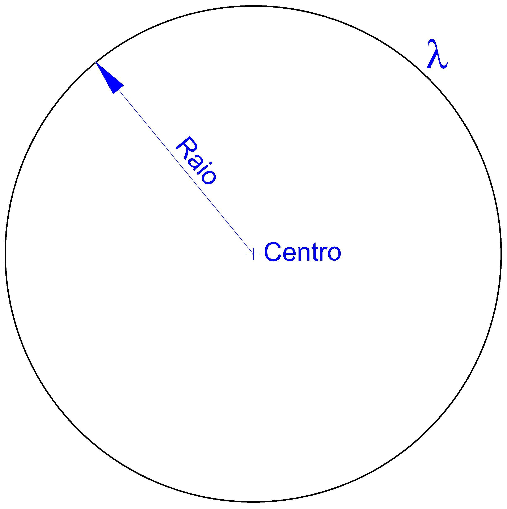
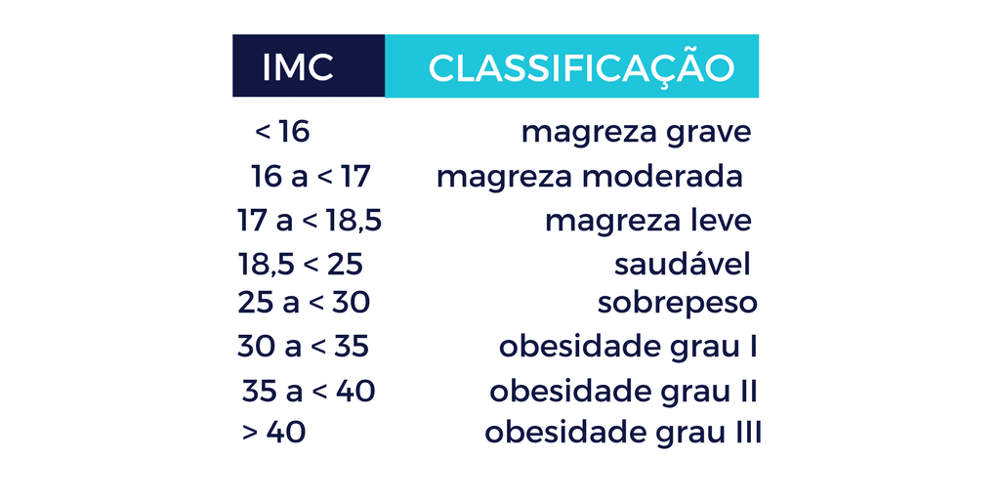
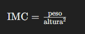
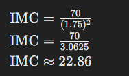

 

Estrutura Condicional simples e composta
-
"Se tiver R$ 90,00 sobrando então ierei comprar uma calça." 
-> Ela é uma expressão lógica, pois a pergunta "tenho R$ 90,00 sobrando?" pode (tem que) ser respondida com "SIM" ou "NAO" 
- - esse é um exemplo de estrutura condicional simples. 
Em algoritmo toda condição tem que ser uma expressão lógica. 
-> VERDADEIRO ou FALSO 
Exemplo de sintaxe: 

          if (condicao) {
            < acao acontecera se condicao for verdadeira >
          }
-
          if (tenho R$ 90,00) {
            < comprar calca >
          }
 

Exemplo 1) Crie um algoritmo que leia o nome de uma pessoa, o ano em que essa pessoa nasceu e o ano atual. Calcule  a idade dessa pessoa e imprima uma mensagem caso ela já possua a maioridade(21 anos). 
 

-> Sintaxe de uma estrutura condicional composta
 

      if (condicao) {
        <(acoes se condicao for TRUE)>
      } else {
        <(acoes se condicao for FALSE)>
      }
 

Exemplo 3) Suponha que o cenário financeiro estaja complexo e voce resolve considerar a viagem também pelo Brasil. Sendo assim mantém a condição da viagem para Europa, mas caso o saldo juntado seja inferior a R$ 10.000,00 a viagem será feita dentro do Brasil. Faça um programa que leia o saldo e decida a viagem.
 

      if (saldo >= 1000) {
        <(viagem para Europa)>
      } else {
        <(viagem dentro do Brazil)>
      }
 

Exemplo 4) Faça um algoritmo para calcular a área de um círculo. O valor do raio deve ser lido pelo program e deve ser positivo.
 

- - Para calcular a area de um circulo, você utiliza a formula: 
Area = π × raio² 
- - Onde: 
  - π (pi) é uma constante aproximadamente igual a 3,14159 (ou pode usar o valor mais preciso necessário para suas aplicações); 
  - raio é a distância do centro do círculo até a sua borda. 
 
- - Passos para calcular a área de um círculo: 
  - Meça o raio do círculo:
    - Esta é a distância do centro até a borda do círculo. 
  - Substitua o valor do raio na fórmula:
    - Elevar o raio ao quadrado significa multiplicar o raio por ele mesmo. 
  - Multiplique pelo valor de π:
    - Use o valor de π adequado para suas necessidades (geralmente 3,14159 é suficiente para muitas aplicações). 
- - Exemplo: 
Suponha que o raio do círculo seja r = 5 unidades. 
Area = π × 5² 
Area = π × 25 
Area ≈ 3.14159 × 25 
Area ≈ 78.54 
Portanto, a área do círculo com raio `5` unidades é aproximadamente 78.5478.54 unidades quadradas.
 

Exemplo 5) Suponha que voce faz uma analise mais realista da viagem e conclui que um saldo menor que R$ 3.000  é melhor não viajar. Fique em casa!! Sendo assim, mantém a condição da viagem para Europa, e caso o saldo juntado seja inferior a R$ 10.000 e igual ou superior a R$ 3.000, a viagem acontecerá no Brasil. Tendo todas essas novas informações, faça um programa que leia o saldo e decida a viagem.

 

Estrutura Condicional switch-case
-

Comando de alternativa de multipla escolha;
- - para cada caso um tipo de resposta, um bloco de resposta a ser atendida;
  - Sintaxe geral:
  - `switch` é uma  espressao de selecao que sera avalida;
  - para cada caso digitado;
  - lista de comando e um `breack`, para parar, stop no codigo;
 

Exemplo 6) Um determinado clube de futebol pretende classificar seus atletas em categorias e para isto ele contratou um desenvolvedor para criar um programa que execute esta tarefa. Para isso o clube criou uma tabela que contem a faixa etaria do atleta e sua categoria.

------

Atividades
-
 

1) Escreva um programa que leia um numero inteiro. Se o numero lido for positivo, escreva uma mensagem indicando se ele é par ou ímpar. Se o numero for negativo, escreva a seguinte mensagem "Este numero não é positivo".
- _Um número inteiro positivo é um `número que é maior que zero e não possui partes decimais`. Exemplos incluem 1, 2, 3, 4, 5, e assim por diante._
  - exemplo de comando:

        num > 0

-_Em termos matemáticos, `0` não é estritamente positivo nem negativo, mas `-O` pode ser considerado como uma representação numérica específica   que é menor que `0` em alguns contextos._
_Para verificar se um número é negativo, incluindo o caso de `-0`, em JavaScript, você pode usar uma simples comparação numérica._

      numero < 0 || (numero === 0 && 1/numero === -Infinity

_Em JavaScript, você pode verificar se um número é `-0` comparando `1/numero` com `-Infinity`. Isso ocorre porque `1/-0` resulta em `-Infinity`, enquanto `1/0` resulta em `Infinity`. Essa verificação é útil para distinguir `-0` de `0`._

- _Um número inteiro positivo par é um `número inteiro que é maior que zero, não possui partes decimais e é divisível por 2`. Exemplos de números inteiros positivos pares incluem 2, 4, 6, 8, 10, e assim por diante._
  - exemplo de comando para verificar se é par:

        num % 2 === 0

  - exemplo de comando para verificar se é ímpar:

        num % 2 !== 0

  

2) Faça um algoritmo que receba o valor do salario de uma pessoa e o valor de um financiamento pretendido. Caso o financiamento seja menor ou igual a 5 vezes o salario da pessoa, o algoritmo devera escrever "Financiamento Concedido"; senão, ele devera escrver "Financiamento Negado". Independente de conceder ou nao o financiamento, o algoritmo escrevera depois a frase "Obrigado por nos consultar.". 

 

3) Escreva um algoritmo que calcule a media de um aluno numa dada disciplina e imprima o resultado. `Regra:` Durante o semestre o aluno faz 3 avaliações com notas de 0 a 10. É considerado aprovado, o aluno que consegue nota igual ou superior a 7. Se este ficar com nota menor que 7 e maior ou igual a 5, sera considerado de recuperaçao. No entanto, se a nota for abaixo de 5, o aluno sera considerado reprovado e devera repetir o semestre.

 

4) Escreva o algoritmo "Programa Solitario". O doador deve clicar nas opçoes (mostradas abaixo) para efetuar a sua doação. Imprima o resultado na tela com o valor da doação e uma mensagem de agradecimento. Utilize a estrutura `Switch...Case`.   [1] para doar R$ 10   [2] para doar R$ 25   [3] para doar R$ 50   [4] para doar outros valores   [5] para cancelar.

 

5) Escreva o algoritmo que calcule o IMC de uma pessoa e imprima a situação em que ela se encontra. `Regra:` IMC = Massa / Altura²  

* (maior ou igua a 40 ....)

O Índice de Massa Corporal (IMC) é uma medida que relaciona o peso e a altura de uma pessoa. Ele é amplamente utilizado para categorizar o peso de acordo com as seguintes faixas:

1. **Abaixo do peso:** IMC abaixo de 18,5
2. **Peso normal:** IMC entre 18,5 e 24,9
3. **Sobrepeso:** IMC entre 25 e 29,9
4. **Obesidade:** IMC 30 ou superior

Para calcular o IMC, você pode seguir estas etapas:

1. **Obtenha seu peso em quilogramas (kg).**
2. **Obtenha sua altura em metros (m).**
3. **Calcule o IMC utilizando a fórmula:**

Por exemplo, se uma pessoa pesa 70 kg e tem 1,75 m de altura:

Neste caso, o IMC calculado é aproximadamente 22.86, o que está dentro da faixa de peso normal.

É importante lembrar que o IMC é uma medida simples e rápida, mas não leva em consideração a composição corporal (como músculos versus gordura), nem a distribuição de gordura corporal. Por isso, é sempre bom considerar outras medidas de saúde e consultar um profissional da saúde para uma avaliação mais completa.
 

## Challenge: 
Faça um programa que leia quatro valores I, n1, n2, e n3 são `quaisquer valores reais`. O programa deve escrever os valores lidos e:   

-------
Valores reais referem-se a qualquer número que pode ser encontrado em uma reta numérica, incluindo números inteiros, decimais e frações. Em outras palavras, são todos os números que não são complexos ou imaginários. Exemplos de valores reais incluem:

- Números inteiros como -3, 0, 7
- Números decimais como -1.5, 2.718, 10.333
- Frações como 3/4, -2/5, 1/2

Esses valores podem ser positivos, negativos ou zero, e são representados em uma linha contínua, permitindo que sejam comparados e operados matematicamente de acordo com as regras usuais da aritmética.

 

------
- se I = 1, escrever os tres valores n1, n2 e n3 em ordem crescente;
- se I = 2, escrever os tres valores n1, n2 e n3 em ordem decrescente;
- se I = 3, escrever os tres valores n1, n2 e n3 de forma que o maior valor fique entre os outros dois;

 

- se I nao for um dos tres valores acima, imprima uma mensagem indicando este comportamento.